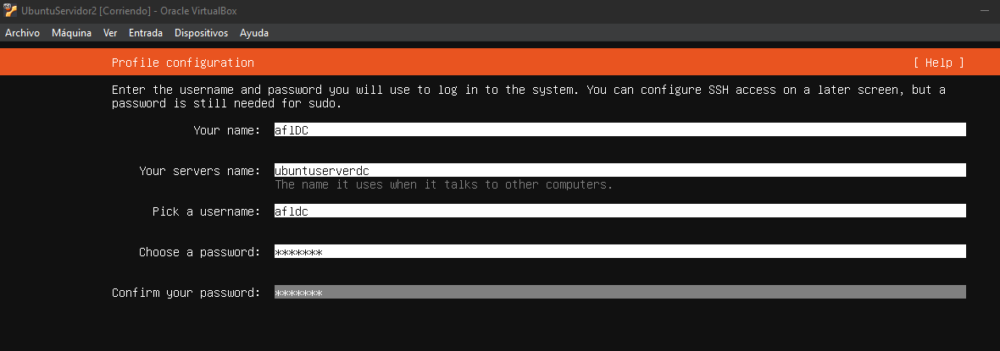
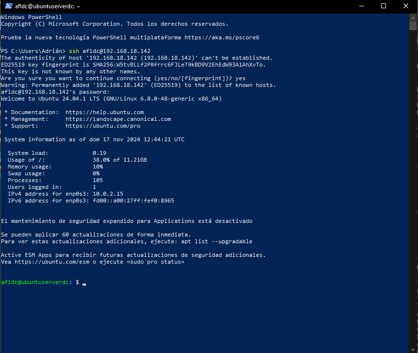
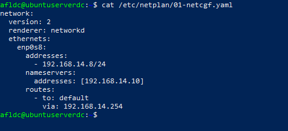
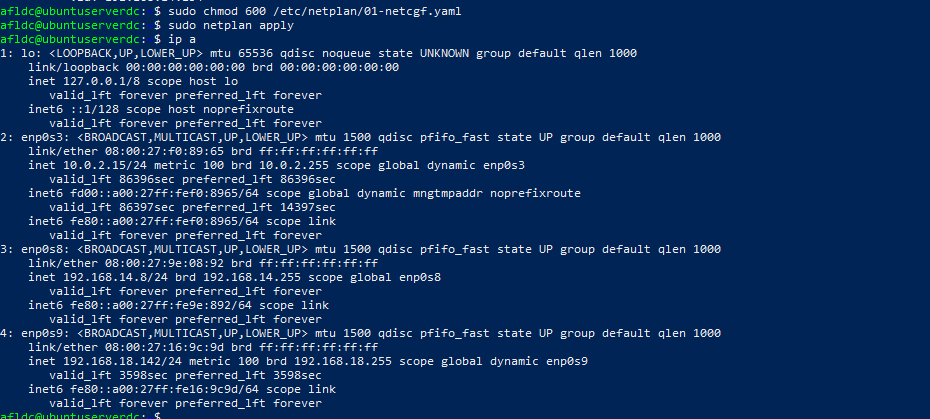
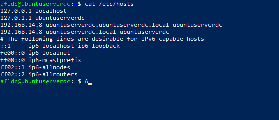
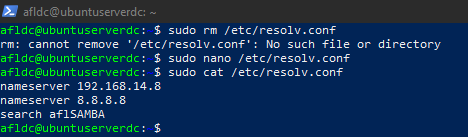
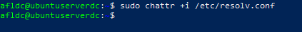
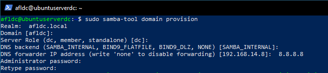
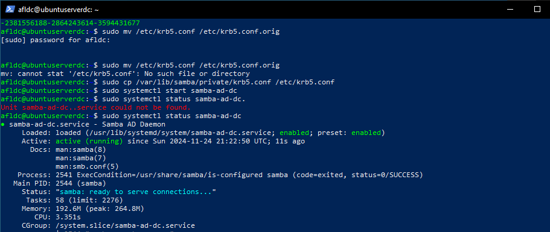
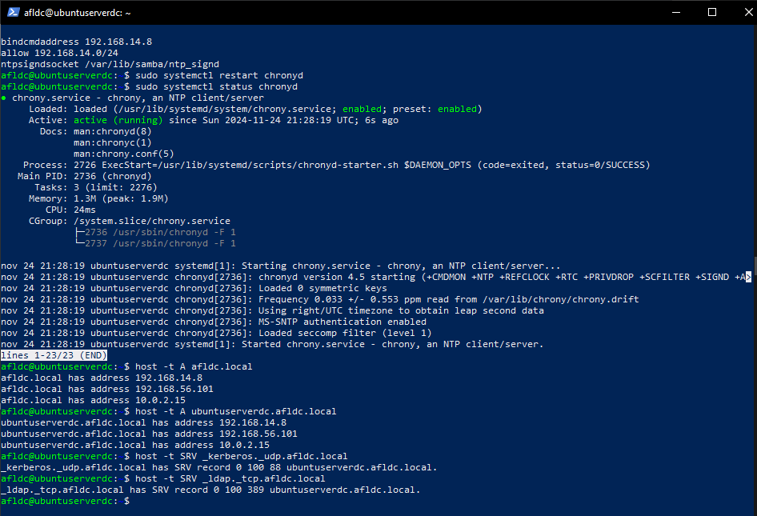

# Actividade 3.1 - Samba 4 AD en Ubuntu Server

Adrián Francisco Lobato

## 1. Configuración previa de las máquinas

Vamos a configurar tres interfaces de red en la máquina virtual.

### Configuración del perfil de usuario en el servidor durante la instalación

Hacemos los siguientes comandos para instalar ssh:

sudo apt install ssh –y  
sudo systemctl start ssh  
sudo systemctl status ssh  

Nos conectaremos a la máquina servidor desde nuestro equipo local (PowerShell) utilizando el siguiente comando:  
ssh afldc@192.168.18.142

### Configuración de IP estática

Configuraremos un archivo .yaml para asignar una IP estática a nuestro servidor utilizando los siguientes comandos:  
sudo nano /etc/netplan/01-netcfg.yaml

Aplicaremos los permisos adecuados al archivo .yaml y verificaremos que los cambios se hayan aplicado correctamente con los siguientes comandos:  
1. Aplicar permisos al archivo .yaml:  
   sudo chmod 600 /etc/netplan/01-netcfg.yaml  
2. Aplicar los cambios de red:  
   sudo netplan apply  
3. Verificar la configuración de la red:  
   Para comprobar que la IP fija se ha asignado correctamente, utiliza el siguiente comando:  
   ip a

   

### Editar el archivo /etc/hosts

El siguiente paso será deshabilitar el servicio que gestiona automáticamente resolv.conf y eliminar el enlace simbólico. Luego, crearemos un nuevo archivo resolv.conf, configurando el DNS con la IP de nuestro servidor y el DNS de Google. Además, se debe asegurar que al realizar un ping al nombre de host, se resuelva correctamente como aflSAMBA.

## Instalación de Samba

Primero, actualizamos los repositorios de APT e instalamos Samba junto con todos los paquetes y dependencias necesarios:

sudo apt update  
sudo apt install -y acl attr samba samba-dsdb-modules samba-vfs-modules smbclient winbind \  
libpam-winbind libnss-winbind libpam-krb5 krb5-config krb5-user dnsutils chrony net-tools

Durante la instalación, se solicitarán un nombre de dominio y un FQDN para el servidor. Utilizaremos los nombres afldc.local como dominio y ubuntuserverdc.afldc.local como FQDN.  
Cuando todos los paquetes se hayan instalado correctamente, deshabilitaremos los servicios que no necesitaremos para esta configuración. Ejecuta:  

sudo systemctl disable --now smbd nmbd winbind

A continuación, activaremos el servicio de Active Directory y Domain Controller. Esto se realiza con los siguientes comandos:

sudo systemctl unmask samba-ad-dc  
sudo systemctl enable samba-ad-dc

Antes de configurar el servicio de Samba, es importante realizar una copia de seguridad del archivo de configuración existente para prevenir posibles problemas. Usa este comando para renombrar el archivo original:

sudo mv /etc/samba/smb.conf /etc/samba/smb.conf.orig

Finalmente, configuraremos los parámetros del dominio utilizando la herramienta samba-tool, que nos permitirá ajustar el servidor según las necesidades específicas de nuestro entorno.

Primero, haremos una copia de seguridad del archivo de configuración de Kerberos. Para ello, renombraremos el archivo existente con sudo mv /etc/krb5.conf /etc/krb5.conf.orig y luego copiaremos el archivo generado por Samba con sudo cp /var/lib/samba/private/krb5.conf /etc/krb5.conf. Después de esto, iniciaremos el servicio de Active Directory con sudo systemctl start samba-ad-dc y verificaremos su estado usando sudo systemctl status samba-ad-dc para confirmar que todo funciona correctamente.

### Configuración de la sincronización del tiempo y el servidor NTP

El siguiente paso será configurar la sincronización del tiempo y el servidor NTP. Cambiaremos los permisos del directorio que Samba utiliza para las firmas de tiempo con los comandos  
sudo chown root:_chrony /var/lib/samba/ntp_signd/  
sudo chmod 750 /var/lib/samba/ntp_signd/.  
Luego, editaremos el archivo de configuración de Chrony con sudo nano /etc/chrony/chrony.conf y añadiremos las siguientes líneas:  
• bindcmdaddress 192.168.14.8  
• allow 192.168.14.0/24  
• ntpsigndsocket /var/lib/samba/ntp_signd

Esto permitirá que el servidor actúe como la referencia de tiempo para toda la red. Tras guardar los cambios, reiniciaremos el servicio con sudo systemctl restart chronyd y verificaremos su estado con sudo systemctl status chronyd.

### Verificación de configuración de servicios

Finalmente, confirmaremos que los nombres del dominio y los servicios de Kerberos y LDAP estén configurados correctamente. Para ello, utilizaremos los siguientes comandos:  
• host -t A afldc.local  
• host -t A dc.afldc.local  
• host -t SRV _kerberos._udp.afldc.local  
• host -t SRV _ldap._tcp.afldc.local

Estos pasos aseguran que todo apunte correctamente al servidor y que los servicios estén funcionando como se espera.

