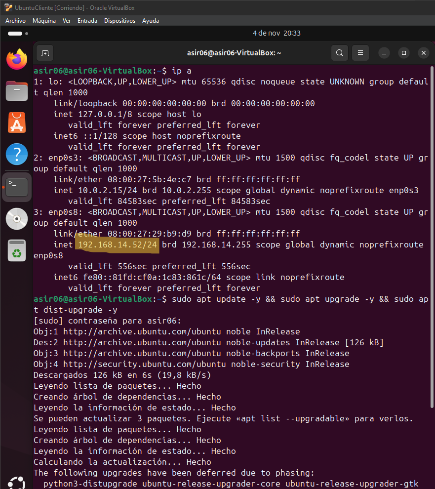

# OpenLDAP

## Adrian Francisco Lobato


## Actividade 1.1 - OpenLDAP dende o intérprete de comandos

### 1.Introducción y Preparación del Entorno.

```
1 Configura o enderezo IP do segundo adaptador (en modo Rede Interna). Para iso, edita o
ficheiro de configuración de rede segundo o sistema que uses.
```




Primer Adaptador en Nat y el segundo en Red Interna


Se hacen Ping todo correcto


### 2.Configuración del Servidor DHCP.

1. Configuración del DHCP.
Primero, configuraremos el servidor DHCP accediendo al archivo de configuración .conf.
Al final de este archivo, realizaremos las modificaciones necesarias.


```
Después de aplicar los cambios, verificaremos que la configuración es correcta utilizando un
comando específico.
```
```
A continuación, editaremos otro archivo de configuración para especificar qué tarjeta de red
utilizará el DHCP.
```

```
Finalmente, reiniciaremos el servicio para que los cambios surtan efecto y comprobaremos
su estado.
```

Una vez hecho esto, conectaremos ambas máquinas a la red interna y confirmaremos que el
cliente ha recibido correctamente una dirección IP.


### 3.Instalación y configuración de LDAP.

1. Configuración del DHCP.
Instalamos el servicio Ldap-utils


```
Después ala hora de la instalación seguiremos los siguientes pasos
```


### 4.Creación de la unidad organizativa.

1. Crear OU.
Procedemos a generar el archivo necesario para la creación de la unidad organizativa.

```
A continuación, importamos este archivo al servidor LDAP.
```

1. Crear usuario.

El proceso para crear usuarios será similar al de los grupos. La única diferencia estará en la
sintaxis del archivo utilizado.


