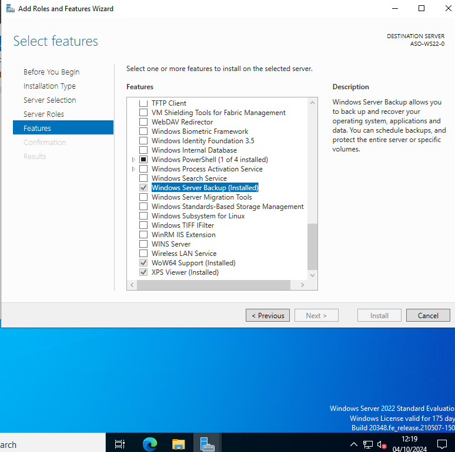
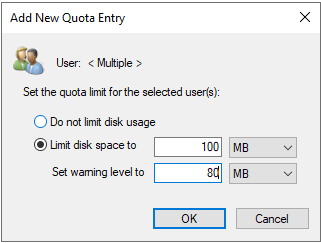
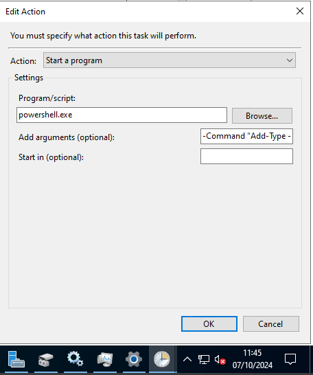
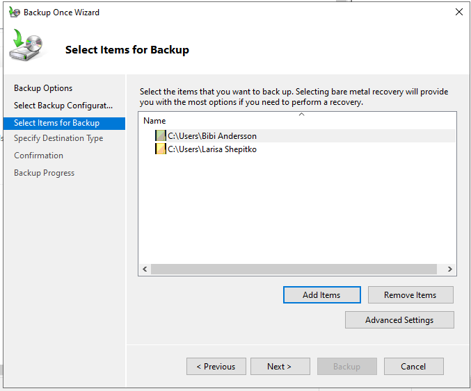

# Guía para Configuración de Windows Server 2022

## 2. Eliminar a necesidade de usar CTRL+ALT+DEL
### Paso 1: Abrir gpedit.msc
1. Presionamos a tecla Windows + R, escribimos `gpedit.msc` e presionamos Enter.

### Paso 2: Buscar ás políticas
1. En **Computer Configuration > Windows Settings > Security Settings > Local Policies > Security Options**.
2. Encontrarás unha opción: **Do not require CTRL+ALT+DEL** e seleccionamos **Enabled**.

---

## 3. Modificar as directivas de contrasinais
### Paso 1: Abrir gpedit.msc
1. Presionamos a tecla Windows + R, escribimos `gpedit.msc` e presionamos Enter.

### Paso 2: Buscar ás políticas de contrasinais
1. Vai a **Computer Configuration > Windows Settings > Security Settings > Account Policies > Password Policy**.
2. Cambia **Minimum password age** a **15** e **Maximum password age** a **60**.

---

## 4. Engadir novas usuarias
### Paso 1: Abrir Computer Management
1. Fai clic dereito en **Inicio** e selecciona **Computer Management**.

### Paso 2: Crear novas contas de usuario
1. Navegamos a **Local Users and Groups > Users**, facemos clic dereito en **New User** e creamos os usuarios pertinentes:
   - Larisa Shepitko
   - Bibi Andersson
   - Monica Vitti

---

## 5. Crear grupos e engadir os usuarios
### Paso 1: Crear os grupos
1. Navegamos a **Local Users and Groups > Groups**, facemos clic dereito en **New Group** e creamos os dous grupos necesarios: **Directoras** e **Actrices**.

### Paso 2: Engadir usuarios aos grupos
1. Facer clic dereito no grupo e seleccionar **Add to Group**.
2. Engadir a Larisa Shepitko no grupo **Directoras** e a Bibi Andersson e Monica Vitti no de **Actrices**.

---

## 6. Engadir a característica de Copias de Seguridad Windows Server
### Paso 1: Abrir o Administrador do Servidor
1. Selecciona **Add roles and features**.

### Paso 2: Engadir Windows Server Backup
1. Segue o asistente e selecciona **Windows Server Backup** en **Features**.

---

## 7. Establecer cuotas de disco
### Paso 1: Abrir o explorador de arquivos
1. Na unidade onde están as carpetas de usuario.

### Paso 2: Facer clic dereito na carpeta do usuario
1. Selecciona **Properties**.
2. Na pestaña **Quota**, activa **Enable quota management**.
3. Establece as cuotas en **Quota Entries**, **Quota > New Quota Entry**:
   - Bibi Andersson e Monica Vitti: **100 MB**.
   - Larisa Shepitko: **200 MB**.

---

## 8. Crear carpetas e establecer permisos
### Paso 1: Crear carpetas
1. Crea as seguintes carpetas no directorio de usuario:
   - **the-ascent-1977** para Larisa Shepitko.
   - **persona-1966** para Bibi Andersson.
   - **l'avventura-1960** para Monica Vitti.

### Paso 2: Configurar permisos
1. Fai clic dereito en cada carpeta, selecciona **Properties > Security > Edit**.
2. Asigna permisos:
   - **Control total** a Larisa Shepitko para **the-ascent-1977**.
   - **Read e Execute** a Bibi Andersson para **persona-1966**.
   - **Read** a Monica Vitti para **l'avventura-1960**.

---

## 9. Listar e deshabilitar servizos innecesarios
### Paso 1: Abrir services.msc
1. Busca `services.msc` no menú de inicio.

### Paso 2: Listar servizos automáticos
1. Ordena por **Startup Type** para ver cales son **Automatic**.
2. Fai clic dereito nos servizos innecesarios e selecciona **Stop** e **Disable**:
   - **Bluetooth Support Service**: Este servizo é necesario só se se usan dispositivos Bluetooth.
   - **Print Spooler**: Este servizo é responsable da xestión de impresións.
   - **Windows Search**: Este servizo permite a indexación de arquivos para a busca rápida.

---

## 10. Crear tarefa programada
### Paso 1: Abrir o Programador de tarefas
1. Busca **Task Scheduler** no menú de inicio e ábreo.

### Paso 2: Crear nova tarefa
1. Selecciona **Create Basic Task**.
2. Asigna un nome e configura a tarefa para que se repita cada hora cunha acción de mostrar un mensaxe: "Esta noite debo ver The Conversation (1974)".

---

## 11. Monitor de Rendemento
### Paso 1: Abrir o Monitor de rendemento
1. Busca **Performance Monitor** no menú de inicio.

### Paso 2: Mostrar información
1. Engade contadores para **Physical Disk**, **Processor**, **Network Interface**, e **Memory**.

---

## 12. Ver procesos con maior consumo
### Paso 1: Abrir o Administrador de tarefas
1. Presiona **Ctrl + Shift + Esc**.

### Paso 2: Ver os procesos
1. Ordena por **CPU**, **Disco** e **Memoria** clicando encima para identificar os 5 procesos con maior consumo.

---

## 13. Crear copia de seguridade de carpetas
### Paso 1: Abrir Windows Server Backup
1. Busca **Windows Server Backup** e ábreo.

### Paso 2: Crear unha nova copia de seguridade
1. Selecciona as carpetas de Larisa Shepitko e Bibi Andersson.

---

## 14. Disminuír a prioridade do Bloc de Notas
### Paso 1: Abrir o Bloc de Notas
1. Abre o Bloc de Notas desde o menú de inicio.

### Paso 2: Abrir o Administrador de tarefas
1. Presiona **Ctrl + Shift + Esc**.

### Paso 3: Cambiar a prioridade
1. Busca **Notepad** en **Details**, fai clic dereito e selecciona **Set priority > Below Normal**.

