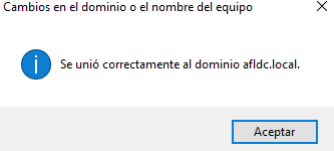
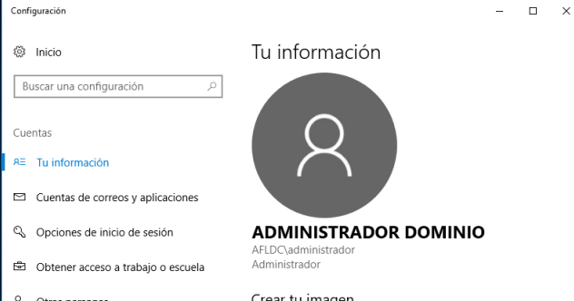
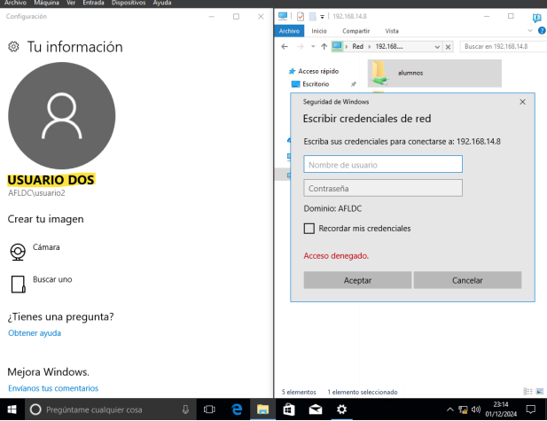
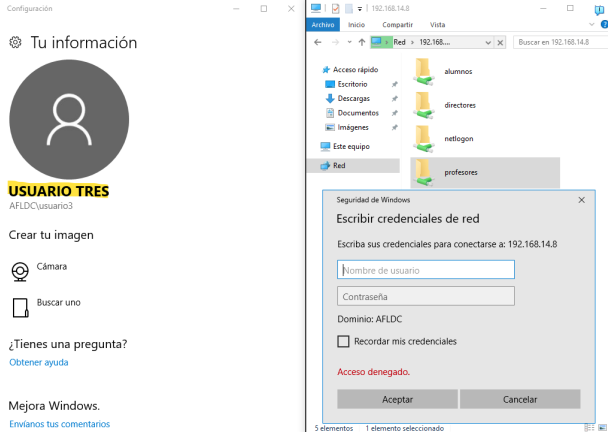
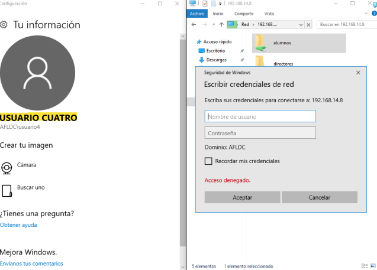

# Actividade 6.1 - Integración de equipos  
**Windows en Samba AD con Ubuntu Server**  
**Adrián Francisco Lobato**

## 1. Configuración do equipo Windows 10 no dominio Samba AD

### a) Unir o equipo Windows ao dominio

1. Asegúrate de que o equipo Windows 10 (192.168.14.9) está na mesma rede que o equipo Ubuntu.
2. Abre o Panel de Control no equipo Windows.
3. Vai a **Sistema e Seguridade → Sistema → Configuración avanzada do sistema**.
4. Na pestana **Nome do equipo**, fai clic en **Cambiar...**.
5. Selecciona **Dominio**, e introduce o nome do dominio Samba AD: `afldc.local`.

6. Introduce as credenciais dun usuario con privilexios para unir equipos ao dominio.
7. Reinicia o equipo para aplicar os cambios.

## Probar Carpetas Compartidas

Vamos a acceder ao dominio con diferentes usuarios e probaremos os accesos ás carpetas:

1. **Usuario2 (Profesores):**  
   Probaremos a entrar na carpeta de **Profesores** e logo na de **Directores**. Debería permitirle acceder só a **Profesores**.
	
2. **Usuario3 (Alumnos):**  
   Probaremos a entrar na carpeta de **Alumnos** e logo na de **Profesores**. Debería permitirle acceder só a **Alumnos**.
	
3. **Usuario4 (Directores):**  
   Probaremos a entrar na carpeta de **Directores** e logo na de **Alumnos**. Debería permitirle acceder só a **Directores**.
	
## 2. Instalar DHCP

1. Primeiro, teremos que instalar o paquete `isc-dhcp-server` con o seguinte comando:

   sudo apt install isc-dhcp-server

2. El siguiente paso será modificar el archivo de configuración DHCP.  
   - Pondremos el nombre de nuestro dominio.
   - Descomentaremos la línea que dice `authoritative`.
   - En `default-lease-time` pondremos `3600`.

3. Al final de todo, en el mismo archivo, escribiremos la configuración de las VLANs DHCP.

4. Reiniciaremos el servicio DHCP con el siguiente comando:
   sudo systemctl restart isc-dhcp-server

5. Ahora, iremos al cliente de Linux y configuraremos la tarjeta de red para que obtenga la configuración por DHCP.

6. Haremos lo mismo con el cliente Windows. Entraremos a la configuración de red y pondremos que obtenga una IP automáticamente.

## Modificar NFTABLES

1. Modificaremos nftables para que los equipos tengan salida a Internet y pondremos las reglas con las nuevas IPs. Ejecutaremos lo siguiente:
   sudo nft add rule ip nat postrouting oifname "enp0s3" ip saddr 192.168.24.0/24 counter masquerade

2. Luego, ejecutamos esta otra regla:
   sudo nft add rule ip nat postrouting oifname "enp0s3" ip saddr 192.168.34.0/24 counter masquerade
