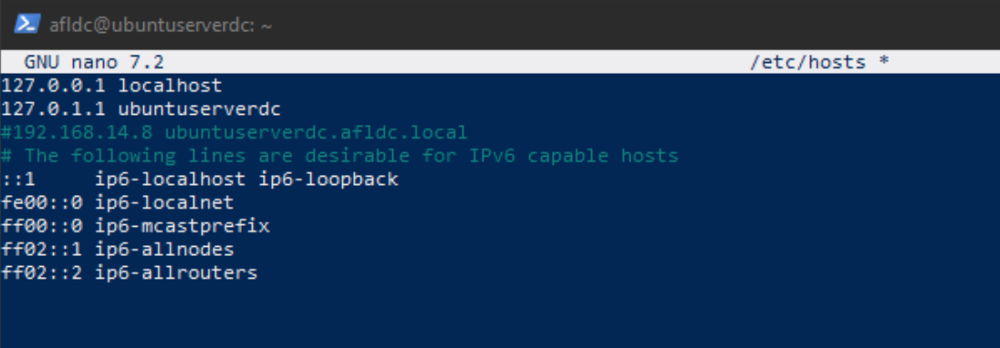
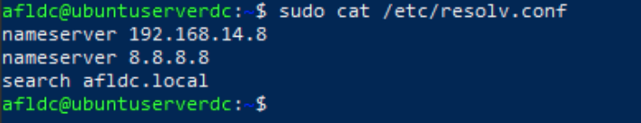
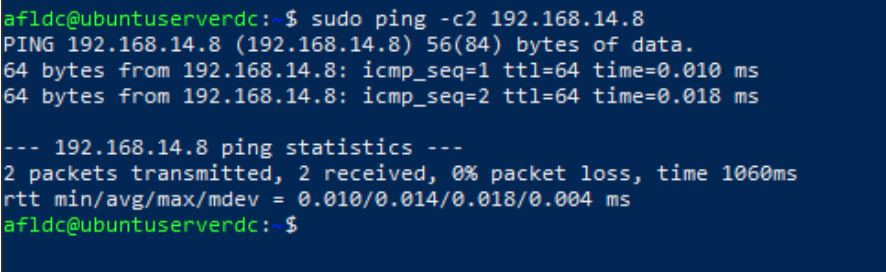
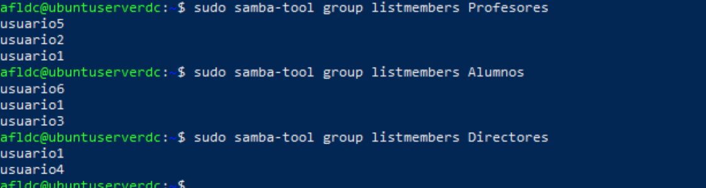
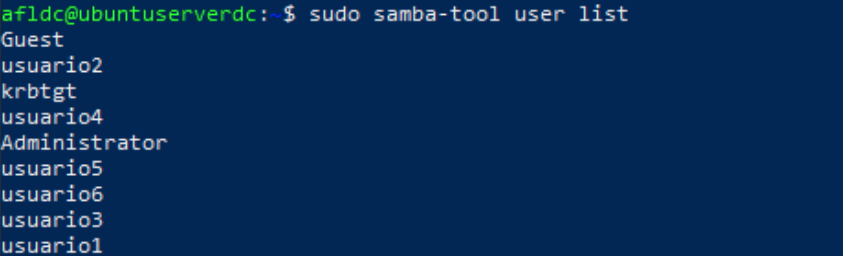
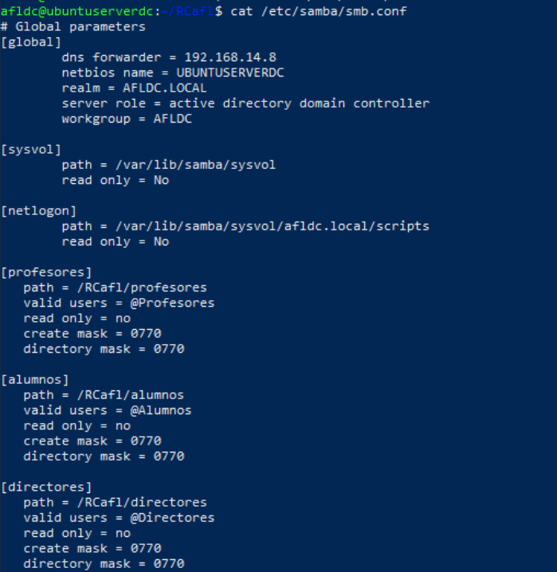
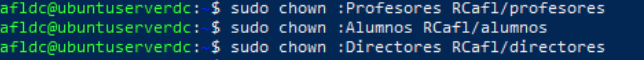
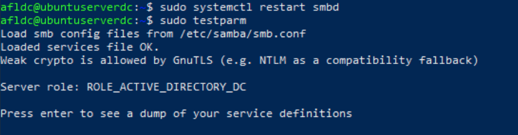

# Actividad 3.2 – Recursos compartidos en Samba AD

**Adrián Francisco Lobato**

## 1 – Deshackear /etc/hosts

Debido a un uso excesivo de /etc/hosts, realizaremos algunos ajustes para que el servidor sea más eficiente utilizando /etc/resolv. Para ello, haremos lo siguiente.

Eliminaremos todas las referencias al servidor Samba4 en el archivo hosts. Simplemente comentar las líneas será suficiente.



El /etc/resolv.conf debería estar así:



Hacemos un ping a la IP a ver si responde.




## 2. Infraestructura de AD con samba-tool

Deberéis crear una infraestructura de directorio activo (a través de Samba AD) utilizando un hardware samba-tool que consta de:

- 3 grupos diferentes con al menos 2 usuarios en cada uno de ellos.
- 1 usuario debe pertenecer a los 3 grupos.
- Debe haber usuarios que pertenezcan solo a un grupo.

Podéis basaros en la estructura creada para la Actividad 1.2.

### Crear los grupos

Crear los tres grupos: Profesores, Alumnos y Directores.

```bash
sudo samba-tool group add Profesores
sudo samba-tool group add Alumnos
sudo samba-tool group add Directores

### Crear los usuarios

Ahora, crearemos usuarios para cada grupo, cumpliendo con los siguientes requisitos:

1. Un usuario debe pertenecer a los tres grupos.
2. Habrá usuarios que pertenezcan solo a un grupo.

### Crear los usuarios:

- **Usuario 1** (Pertenecerá a los 3 grupos: Profesores, Alumnos, Directores):

```bash
sudo samba-tool user add usuario1 --given-name="Usuario" --surname="Uno" --password=contraseña
sudo samba-tool group addmembers Profesores usuario1
sudo samba-tool group addmembers Alumnos usuario1
sudo samba-tool group addmembers Directores usuario1

- **Usuario 2** (Pertenecerá solo al grupo Profesores):

```bash
sudo samba-tool user add usuario2 --given-name="Usuario" --surname="Dos" --password=contraseña
sudo samba-tool group addmembers Profesores usuario2

- **Usuario 3** (Pertenecerá solo al grupo Alumnos):

```bash
sudo samba-tool user add usuario3 --given-name="Usuario" --surname="Tres" --password=contraseña
sudo samba-tool group addmembers Alumnos usuario3

- **Usuario 4** (Pertenecerá solo al grupo Directores):

```bash
sudo samba-tool user add usuario4 --given-name="Usuario" --surname="Cuatro" --password=contraseña
sudo samba-tool group addmembers Directores usuario4

- **Usuario 5** (Pertenecerá solo al grupo Profesores):

```bash
sudo samba-tool user add usuario5 --given-name="Usuario" --surname="Cinco" --password=contraseña
sudo samba-tool group addmembers Profesores usuario5

- **Usuario 6** (Pertenecerá solo al grupo Alumnos):

```bash
sudo samba-tool user add usuario6 --given-name="Usuario" --surname="Seis" --password=contraseña
sudo samba-tool group addmembers Alumnos usuario6

### 6. Verificación de la membresía de los grupos

```bash
sudo samba-tool group listmembers Profesores
sudo samba-tool group listmembers Alumnos
sudo samba-tool group listmembers Directores



### 7. Pruebas de la configuración

Una vez que todo esté configurado, puedes listar los usuarios del dominio para asegurarte de que se han creado correctamente:

```bash
sudo samba-tool user list




markdown
Copiar código
## 3. Recursos compartidos

Deberéis crear 3 recursos compartidos mediante Samba en Ubuntu Server. La ubicación base de los recursos compartidos será una carpeta en el directorio raíz que deberéis levantar como vuestras iniciales tras el acrónimo "NAS". En este caso, la ubicación será `/NASdgc`.

Podedes nomear os 3 recursos como queirades.

Cada uno de los recursos debe ser accedido exclusivamente por 1 solo grupo. Deberéis mostrar este punto como capturas que se consideran. 

Los usuarios que pertenecen a varios grupos deben poder acceder a los recursos correspondientes.

De novo, documentade coas capturas pertinentes.

Sería interesante que el usuario administrador (supoño que así chamáchedes al usuario administrador de Samba AD) pueda acceder a los 3 recursos. Buscade o xeito de facelo, explicádeo e xustifádeo.

### Crear las carpetas base y asignar permisos

Primero, vamos a crear la carpeta **RCafl**, que será el directorio raíz de los recursos compartidos, y luego las subcarpetas **profesores**, **alumnos** y **directores**.

```bash
mkdir RCafl
sudo chmod -R 775 RCafl
sudo chown -R root:"domain users" RCafl
cd RCafl/
sudo mkdir profesores
sudo mkdir alumnos
sudo mkdir directores

### Configuración de Samba para compartir los directorios

Ahora, necesitas configurar Samba para compartir estos directorios con los grupos correspondientes (**profesores**, **alumnos**, y **directores**).

#### Paso 1: Editar el archivo de configuración de Samba

```bash
sudo nano /etc/samba/smb.conf



### Asegurar los permisos correctos para las carpetas

Es necesario asegurarse de que las carpetas tengan los permisos correctos, para que solo los grupos correspondientes puedan acceder a ellas.

#### Paso 1: Asignar los permisos a las carpetas

```bash
sudo chown :Profesores /RCafl/profesores
sudo chown :Alumnos /RCafl/alumnos
sudo chown :Directores /RCafl/directores



### Reiniciar el servicio Samba

Una vez que hayas editado el archivo de configuración, reinicia el servicio de Samba para que los cambios surtan efecto:

```bash
sudo systemctl restart smbd


